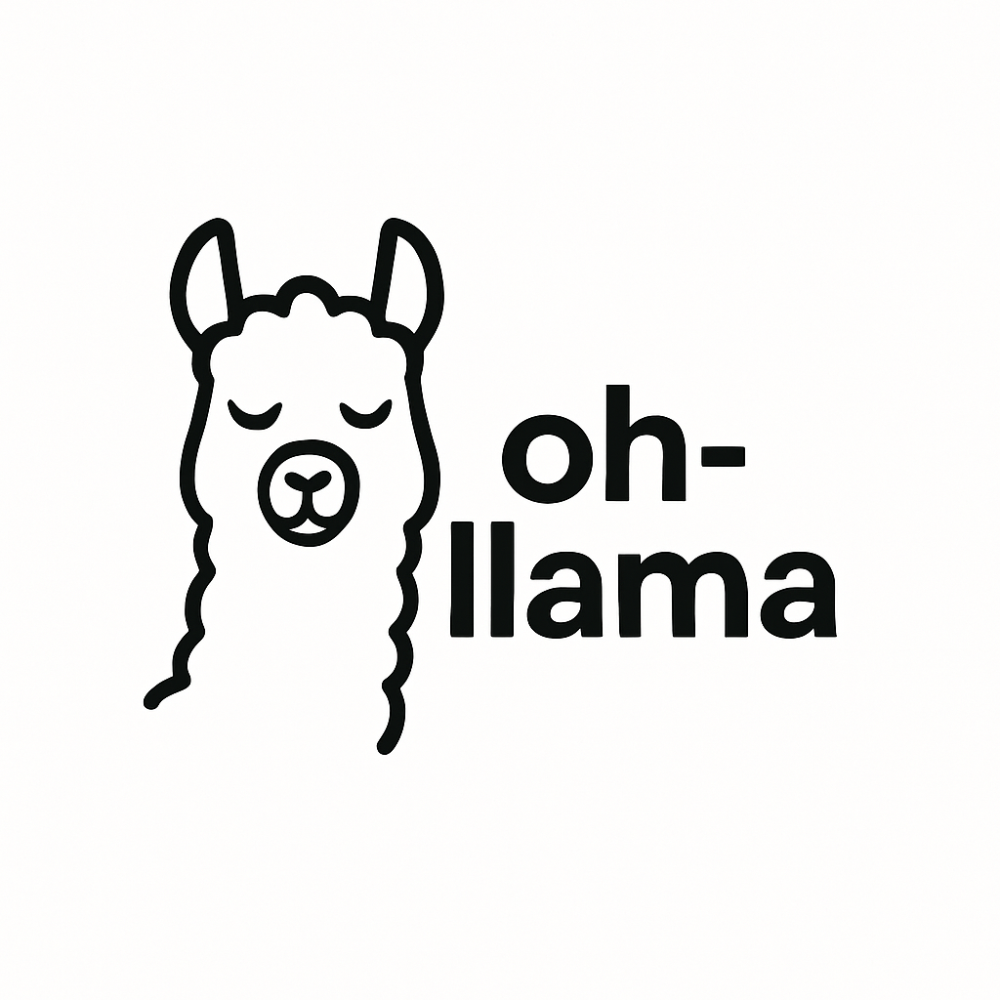

# Oh-Llama

A colorful CLI tool for interacting with Ollama models.

## Features

- Automatically starts Ollama service if not running
- Lists locally installed models
- Fetches available models from Ollama library
- Interactive model selection with arrow key navigation
- Character-by-character streaming of model responses
- Command history with auto-suggestions
- Colorful interface using Rich and Colorama
- Model management (pull new models, delete existing models)
- Command legends and keyboard shortcuts

## Requirements

- Python 3.6+
- Ollama installed and in your PATH

## Installation

1. Clone this repository:

```bash
git clone https://github.com/yourusername/oh-llama.git
cd oh-llama
```

2. Make the script executable:

```bash
chmod +x oh_llama.py
```

3. Run the script:

```bash
./oh_llama.py
```

The script will automatically install required Python packages if they're not already installed.

## Usage

### Basic Usage

```bash
./oh_llama.py
```

This will start the interactive CLI, allowing you to select a model and begin chatting.

### Specify Model Directly

```bash
./oh_llama.py --model llama3
```

This will start a chat session with the specified model directly, pulling it if not already installed.

## Commands

### Model Selection Screen

- Use ↑/↓ arrow keys to navigate
- Press Enter to select a model
- Press Ctrl+D to exit

### Chat Screen

- Type `exit` or `quit` to exit the chat session
- Press Ctrl+D to exit
- Press Ctrl+C to cancel the current input

## License

MIT
